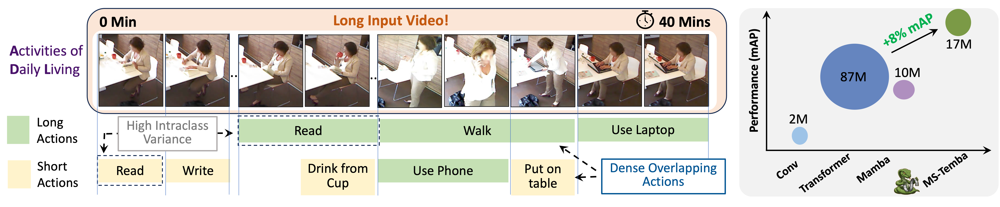

<div align="center" style="display:flex;flex-direction:column;align-items:center;gap:8px;">
    
    <div style="display:flex;align-items:center;gap:8px;flex-wrap:wrap;justify-content:center;">
        <h1 style="margin:0;text-align:center;">MS-Temba: Multi-Scale Temporal Mamba for Understanding Long Untrimmed Videos</h1>
        <a href="https://arxiv.org/abs/2501.06138" target="_blank">
            
        </a>
    </div>
</div>

<div align="center">

</div>

## Abstract
Temporal Action Detection (TAD) in untrimmed videos poses significant challenges, particularly for Activities of Daily Living (ADL) requiring models to (1) process long-duration videos, (2) capture temporal variations in actions, and (3) simultaneously detect dense overlapping actions. Existing CNN and Transformer-based approaches, struggle to jointly capture fine-grained detail and long-range structure at scale. State-space Model (SSM) based Mamba offers powerful long-range modeling, but naive application to TAD collapses fine-grained temporal structure and fails to account for the challenges inherent to TAD. To this end, we propose Multi-Scale Temporal Mamba (MS-Temba), which extends Mamba to TAD with newly introduced dilated SSMs. Each Temba block, comprising dilated SSMs coupled with our proposed additional losses, enables the learning of discriminative representations across temporal scales. A lightweight Multi-scale Mamba Fuser then unifies these multi-scale features via SSM-based aggregation, yielding precise action-boundary localization. With only 17M parameters, MS-Temba achieves state-of-the-art performance on densely labeled ADL benchmarks TSU & Charades, and further generalizes to long-form video summarization, setting new state-of-the-art results on TVSum & SumMe.

## Prepare the environment

- Python 3.10.13

  - `conda create -n your_env_name python=3.10.13`

- torch 2.1.1 + cu118
  - `pip install torch==2.1.1 torchvision==0.16.1 torchaudio==2.1.1 --index-url https://download.pytorch.org/whl/cu118`

- Requirements: vim_requirements.txt
  - `pip install -r vim/vim_requirements.txt`

- Install ``causal_conv1d`` and ``mamba``
  - `pip install -e causal_conv1d>=1.1.0`
  - `pip install -e mamba-1p1p1`

## Prepare the Input Video Features
Like the previous works (e.g. MS-TCT, PDAN), MS-Temba is built on top of the pre-trained video features. Thus, feature extraction is needed before training the network. We train MS-Temba on features extracted using I3D and CLIP backbones.

- Please download the Charades dataset (24 fps version) from this [link](https://prior.allenai.org/projects/charades).
- Please download the Toyota Smarthome Untrimmed dataset from this [link](https://project.inria.fr/toyotasmarthome/).
- Please download the MultiTHUMOS dataset from this [link](http://ai.stanford.edu/~syyeung/everymoment.html).

### I3D features
Follow this [repository](https://github.com/piergiaj/pytorch-i3d) to extract the snippet-level I3D feature. 

### CLIP features
To extract the CLIP features, first extract frames from each video using ffmpeg and save the frames in a directory. Then, please follow the instructions in `vim/clip_feature_extraction.py` to extract the CLIP features.

## Train MS-Temba
We provide the training scripts for Charades, TSU, and MultiTHUMOS datasets in `vim/scripts/`. Please update the paths in the scripts to match the ones on your machine. Modify the argument `-backbone` to set it to `i3d` or `clip` based on the feature extractor backbone used.

For example to train MS-Temba on TSU dataset, run:

`bash vim/scripts/run_MSTemba_TSU.sh`

# Citation
If you use our approach (code or methods) in your research, please consider citing:
```
@article{sinha2025ms,
  title={MS-Temba: Multi-Scale Temporal Mamba for Efficient Temporal Action Detection},
  author={Sinha, Arkaprava and Raj, Monish Soundar and Wang, Pu and Helmy, Ahmed and Das, Srijan},
  journal={arXiv preprint arXiv:2501.06138},
  year={2025}
}
```

## Acknowledgement 
This project is based on Mamba ([paper](https://arxiv.org/abs/2312.00752), [code](https://github.com/state-spaces/mamba)), Vision-Mamba ([paper](), [code](https://github.com/hustvl/Vim)), MS-TCT ([paper](https://openaccess.thecvf.com/content/CVPR2022/papers/Dai_MS-TCT_Multi-Scale_Temporal_ConvTransformer_for_Action_Detection_CVPR_2022_paper.pdf), [code](https://github.com/dairui01/MS-TCT)). Thanks for their wonderful works.


